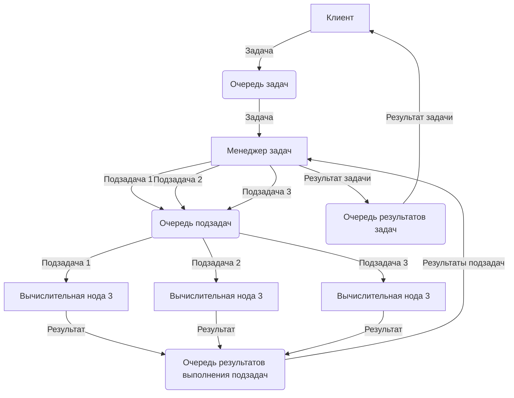

# ПАК рандомизированного машинного обучения 
В данном репозитории расположен программный код программно-алгоритмического комплекса (**ПАК**) реализации методов рандомизированного машинного обучения разрабатываемых по проекту информационной технологии рандомизированного прогнозирования динамики термокарстовых озер в Арктике.

Разработка проводилась в рамках выполнения научного проекта **№ 22-11-20023 "Технология энтропийно-рандомизированного прогнозирования динамики метана в термокарстовых озерах зоны многолетней мерзлоты в условиях современных климатических изменений"**

Для запуска проекта необходимо развернуть контейнеры при помощи конфигурационного файла *docker-compose.yml*. В это файле описаны следующие контейнеры:\
**zookeeper** - хранилище конфигураций Kafka\
**kafka** - брокер сообщений\
**kafka-ui** - UI для управления Kafka\
**controller** - менеджер, который получает основную задачу из Kafka и распределяет по worker_node подзадачи\
**worker_node** - нода выполнения рандомизированного моделирования, выполняющие как задачи восстановления, так и задачи прогнозирования.\
Для увеличения количества экземпляров worker_node, нужно изменить пункт *deploy -> replicas: 3* в описании контейнера worker_node. Количество worker_node влияет на скорость выполнения задач. 

Для управления kafka можно подключиться на веб интерфейс управления http://localhost:8090

Kafka Broker располагается на порту 29092, Zookeeper - 22181.\
Ниже изображена схема работы ПАК:

## Восстановление пропусков

Запуск восстановления необходимо поместить в очередь *RecoveryRequest* json с ключом data следующего формата:

{ \
id: uuid, *- uuid задачи, должен генерироваться каждый раз новый* \
"type": "randomize_modeling" | "polynomial", *- тип восстановления* \
 "main_param_name": "square", *- имя целевого параметра (должен быть одним из ключей объекта data)* \
"data":{\
"precipitation": { "year": value  }, *- осадки* \
"temperature": { "year": value  }, *- температура* \
  "square": { "year": value  } *- площадь*\
}\
}

Ответ будет помещен в очередь *RecoveryAnswer*.

## Прогнозирование данных о площади озер

Запуск прогнозирования необходимо поместить в очередь *ForecastRequest* json с ключом data следующего формата:

{ \
id: uuid, *- uuid задачи, должен генерироваться каждый раз новый* \
"type": "randomize_modeling" | "polynomial", *- тип прогнозирования (в этой версии реализовано только randomize_modeling, параметр не обязательный)* \
"main_param_name": "square", *- имя целевого параметра (должен быть одним из ключей объекта data)* \
"period_type": "short", *- временной промежуток (краткосрочный(short), среднесрочный(middle), долгосрочный(long))*\
"data": {\
"precipitation": { "year": value  }, *- осадки* \
  "temperature": { "year": value  }, *- температура* \
  "square": { "year": value  } *- площадь*\
}\
}

Если будут обнаружены пропуски в данных - автоматически запустится процедура восстановления.
Ответ будет помещен в очередь *ForecastAnswer*.

## Настройки ПАК
Настройки ПАК в файле *configuration.ini,* а именно: настройка количества лет краткосрочного, среднесрочного и долгосрочного прогноза, количество сэмплирований случайной переменной при прогнозировании и восстановлении.